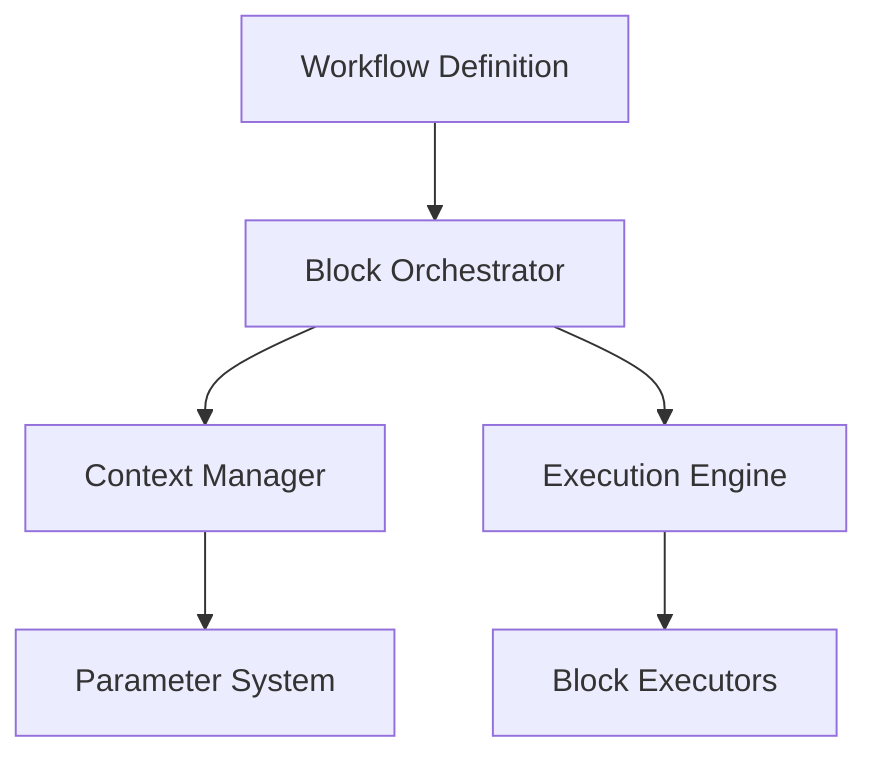
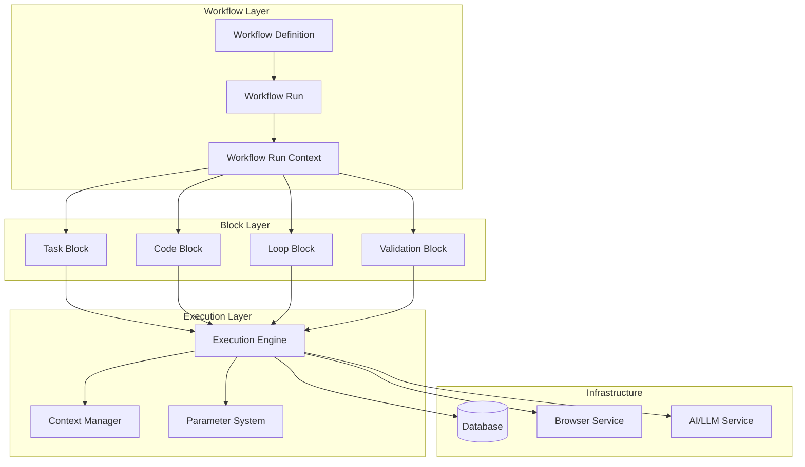
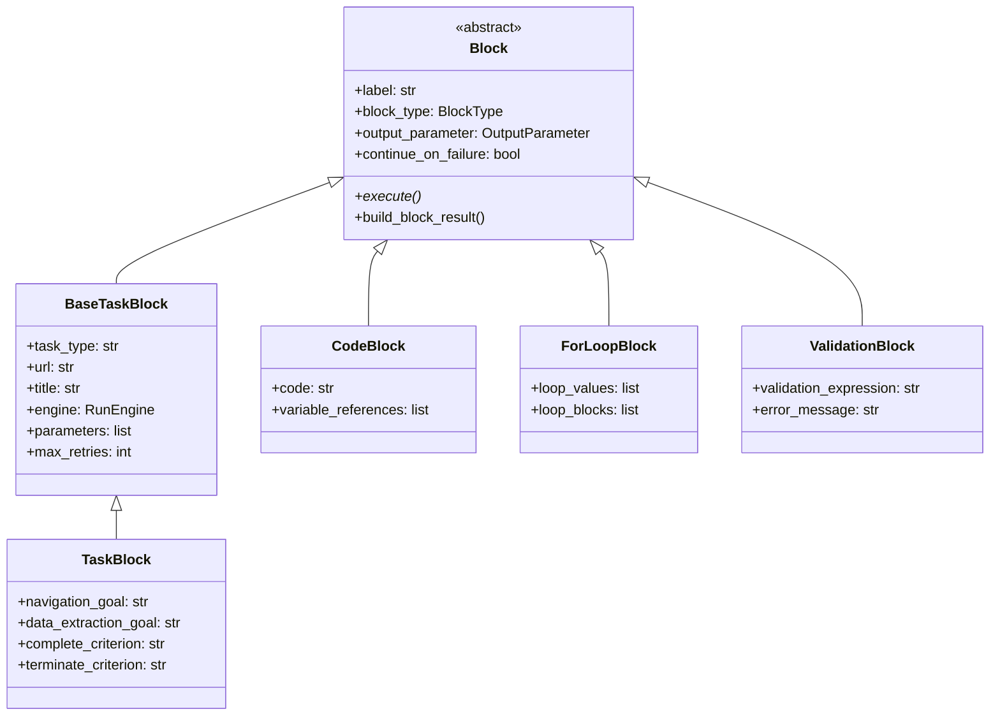
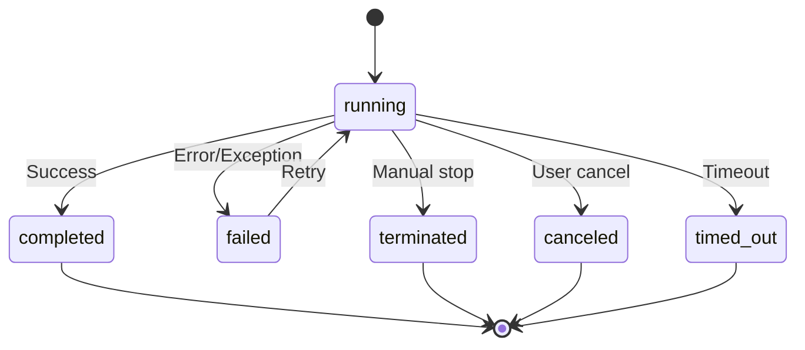

# 🔄 Skyvern Workflow Engine Deep Dive
## Phase 8: Comprehensive Analysis

---

## 📋 Table of Contents

1. **[Introduction & Overview](#slide-1)**
2. **[Workflow Architecture](#slide-2)**
3. **[Block System](#slide-3)**
4. **[Workflow Models](#slide-4)**
5. **[Execution Engine](#slide-5)**
6. **[Context Management](#slide-6)**
7. **[Data Flow & State](#slide-7)**
8. **[Sequence Diagrams](#slide-8)**
9. **[Implementation Examples](#slide-9)**
10. **[Best Practices](#slide-10)**

---

## Slide 1: Introduction & Overview {#slide-1}

### What is the Skyvern Workflow Engine?

The Skyvern Workflow Engine is a **block-based orchestration system** that enables complex automation scenarios through visual workflow composition.

#### Key Features:
- **Visual Block Composition** - Drag-and-drop workflow creation
- **Parameter-Driven Execution** - Dynamic data flow between blocks
- **Multi-Block Types** - Task, Code, Loops, Validations, etc.
- **Context Management** - Shared state across workflow execution
- **Error Handling** - Robust failure recovery and continuation

#### Core Components:


---

## Slide 2: Workflow Architecture {#slide-2}

### High-Level Architecture



### Directory Structure:
```
skyvern/forge/sdk/workflow/
├── models/
│   ├── block.py           # Block base classes
│   ├── parameter.py       # Parameter system
│   └── workflow.py        # Workflow definitions
├── service.py             # Workflow orchestration
├── context_manager.py     # State management
└── exceptions.py          # Error handling
```

---

## Slide 3: Block System {#slide-3}

### Block Types & Hierarchy



### Block Status Lifecycle:



---

## Continue to [Block Models Details →](workflow_engine_blocks.md)

---

*This presentation covers the comprehensive analysis of Skyvern's Workflow Engine as outlined in Phase 8 of the deep dive plan.*