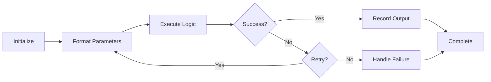
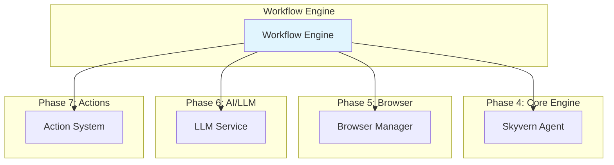

# 📋 Workflow Engine - Summary & Quick Reference
## Phase 8 Complete Learning Guide

---

## 🎯 Executive Summary

### What is Skyvern's Workflow Engine?

Skyvern's Workflow Engine is a **sophisticated block-based orchestration system** that enables complex browser automation scenarios through visual workflow composition. It provides a powerful abstraction layer that allows users to create multi-step automation workflows without deep technical knowledge.

### Key Value Propositions:
- **Visual Workflow Design** - Drag-and-drop interface for complex automation
- **Parameter-Driven Execution** - Dynamic data flow between workflow steps
- **Robust Error Handling** - Comprehensive failure recovery and continuation logic
- **Scalable Architecture** - Designed for enterprise-level automation workloads
- **Integration-Friendly** - Extensible block system for custom functionality

---

## 🏗️ Architecture Quick Reference

### Core Components Hierarchy

```
📦 Workflow Engine
├── 🔧 Workflow Service (Orchestration)
├── 🧩 Block System (Execution Units)
├── 🗂️ Context Manager (State Management)
├── 📊 Parameter System (Data Flow)
└── ⚡ Execution Engine (Runtime)
```

### Block Type Categories

| Category | Block Types | Purpose |
|----------|-------------|---------|
| **Browser Automation** | TASK, TaskV2, ACTION, NAVIGATION, EXTRACTION, LOGIN | Web interaction and data extraction |
| **Control Flow** | FOR_LOOP, VALIDATION, WAIT | Workflow logic and timing |
| **Data Processing** | CODE, TEXT_PROMPT, PDF_PARSER, FILE_URL_PARSER | Data transformation and analysis |
| **File Operations** | FILE_UPLOAD, FILE_DOWNLOAD, DOWNLOAD_TO_S3, UPLOAD_TO_S3 | File handling and storage |
| **Communication** | SEND_EMAIL, HTTP_REQUEST | External notifications and API calls |
| **Navigation** | GOTO_URL | URL-based navigation |

---

## 🔄 Execution Flow Summary

### High-Level Execution Process

1. **Workflow Initiation**
   - API receives workflow execution request
   - WorkflowService creates workflow run record
   - Context Manager initializes workflow context

2. **Context Setup**
   - Parameter registry creation
   - Secret resolution from AWS/external sources
   - Initial state configuration

3. **Block Orchestration**
   - Sequential or parallel block execution
   - Parameter template rendering
   - Output parameter registration

4. **Result Aggregation**
   - Block result collection
   - Workflow status determination
   - Final response generation

### Block Execution Lifecycle



---

## 🧩 Block System Deep Dive

### Base Block Interface

```python
class Block(BaseModel, abc.ABC):
    label: str                    # Unique identifier
    block_type: BlockType        # Block category
    output_parameter: OutputParameter  # Result storage
    continue_on_failure: bool = False  # Error handling
    
    @abc.abstractmethod
    async def execute(self, workflow_run_id: str, 
                     workflow_run_block_id: str,
                     organization_id: str, 
                     workflow_id: str) -> BlockResult:
        pass
```

### Most Important Block Types

#### 1. TaskBlock (Browser Automation)
- **Purpose**: Execute complex browser automation tasks
- **Key Features**: AI-driven navigation, data extraction, form filling
- **Parameters**: URL, navigation goal, extraction schema, completion criteria

#### 2. ForLoopBlock (Iteration Control)
- **Purpose**: Execute nested blocks for each item in a collection
- **Key Features**: Dynamic loop values, nested block execution, context injection
- **Parameters**: Loop values array, child blocks list

#### 3. CodeBlock (Custom Logic)
- **Purpose**: Execute custom Python code within workflow
- **Key Features**: Sandboxed execution, context variable access, security validation
- **Parameters**: Code string, variable references

#### 4. ValidationBlock (Data Quality)
- **Purpose**: Validate data against specified criteria
- **Key Features**: Expression evaluation, error reporting, conditional flow
- **Parameters**: Validation expression, error message

---

## 📊 Parameter System Guide

### Parameter Types Overview

| Type | Description | Use Case | Example |
|------|-------------|----------|---------|
| **WorkflowParameter** | User-defined input values | Configuration, URLs, credentials | `target_url: "https://example.com"` |
| **ContextParameter** | Derived from other parameters | Computed values, transformations | `full_name: "{{first_name}} {{last_name}}"` |
| **OutputParameter** | Results from previous blocks | Data flow between blocks | `extracted_data` from task block |
| **AWSSecretParameter** | Secure credential storage | API keys, passwords, tokens | AWS Secrets Manager integration |

### Template Rendering

Skyvern uses **Jinja2 sandboxed environment** for parameter template rendering:

```python
# Template Example
url_template = "https://{{base_url}}/search?q={{search_term}}"
navigation_goal = "Find products for {{current_item}} in category {{current_index}}"

# Context Variables Available
{
    "base_url": "example.com",
    "search_term": "laptops", 
    "current_item": "electronics",
    "current_index": 0,
    "previous_block_output": {...}
}
```

---

## 🔧 Context Management

### WorkflowRunContext Structure

```python
class WorkflowRunContext:
    workflow_run_id: str          # Unique run identifier
    values: dict[str, Any]        # Parameter values
    secrets: dict[str, Any]       # Secure credentials
    metadata: dict[str, Any]      # Block execution metadata
    parameter_registry: dict      # Parameter definitions
    
    # Key Methods
    def has_value(key: str) -> bool
    def get_value(key: str) -> Any
    def register_parameter(param: Parameter)
    def register_output_parameter_value(param: OutputParameter, value: Any)
    def get_block_metadata(label: str) -> BlockMetadata
```

### Context Lifecycle Management

1. **Creation**: Initialize context with workflow parameters
2. **Parameter Registration**: Register all workflow and block parameters
3. **Execution**: Provide context to blocks during execution
4. **Output Recording**: Store block results for downstream use
5. **Cleanup**: Release resources and clear sensitive data

---

## ⚡ Performance & Scalability

### Optimization Strategies

#### 1. Parallel Execution
- **Block-level parallelism** for independent blocks
- **Resource pool management** for browser sessions
- **Async coordination** for I/O operations

#### 2. Caching Mechanisms
- **Action result caching** for repeated browser operations
- **Parameter value caching** for expensive computations
- **Browser session reuse** across workflow runs

#### 3. Resource Management
- **Memory optimization** for large data processing
- **Database connection pooling** for high concurrency
- **Automatic cleanup** of browser resources

### Monitoring & Observability

```python
# Structured Logging Example
LOG.info(
    "Block execution completed",
    block_type=self.block_type,
    block_label=self.label,
    success=result.success,
    execution_time_seconds=execution_time,
    workflow_run_id=workflow_run_id,
    output_size=len(str(result.output_parameter_value))
)
```

---

## 🛡️ Security & Error Handling

### Security Measures

1. **Code Execution Sandboxing**
   - Restricted built-in functions
   - No file system access
   - No network operations from code blocks

2. **Parameter Validation**
   - Type checking and schema validation
   - SQL injection prevention
   - XSS protection for web parameters

3. **Credential Management**
   - AWS Secrets Manager integration
   - Encrypted parameter storage
   - Access control and audit logging

### Error Handling Patterns

```python
# Comprehensive Error Handling
try:
    result = await self.execute_block_logic()
    return await self.build_success_result(result)
    
except ValidationError as e:
    return await self.build_failure_result(f"Validation failed: {e}")
    
except TimeoutError:
    return await self.build_failure_result("Execution timed out")
    
except SecurityError as e:
    LOG.error("Security violation detected", error=str(e))
    return await self.build_failure_result("Security policy violation")
    
except Exception as e:
    LOG.exception("Unexpected error in block execution")
    return await self.build_failure_result(f"Unexpected error: {e}")
```

---

## 🚀 Best Practices & Guidelines

### Workflow Design Principles

#### 1. Single Responsibility
- Each block should have one clear purpose
- Avoid complex multi-step logic in single blocks
- Use composition for complex workflows

#### 2. Error Resilience
- Always set appropriate `continue_on_failure` flags
- Implement retry logic for transient failures
- Provide meaningful error messages

#### 3. Parameter Management
- Use descriptive parameter names
- Provide default values where appropriate
- Document parameter purposes and formats

#### 4. Performance Optimization
- Minimize browser session creation
- Cache expensive computations
- Use parallel execution for independent blocks

### Code Quality Standards

```python
# ✅ Good Block Implementation
class ProductExtractionBlock(BaseTaskBlock):
    """Extract product information from e-commerce pages.
    
    This block navigates to product pages and extracts structured
    product data including names, prices, and ratings.
    """
    
    # Clear type hints and validation
    max_products: int = Field(default=100, ge=1, le=1000)
    include_reviews: bool = Field(default=True)
    product_selector: str = Field(default=".product-item")
    
    # Comprehensive schema definition
    data_schema: dict = {
        "type": "object",
        "required": ["products"],
        "properties": {
            "products": {
                "type": "array",
                "items": {
                    "type": "object",
                    "required": ["name", "price"],
                    "properties": {
                        "name": {"type": "string", "minLength": 1},
                        "price": {"type": "number", "minimum": 0},
                        "rating": {"type": "number", "minimum": 0, "maximum": 5}
                    }
                }
            }
        }
    }
```

---

## 📚 Key Files & Locations

### Critical Files to Study

| File Path | Purpose | Priority |
|-----------|---------|----------|
| `skyvern/forge/sdk/workflow/models/block.py` | Base block classes and interfaces | 🔥 CRITICAL |
| `skyvern/forge/sdk/workflow/service.py` | Workflow orchestration service | 🔥 CRITICAL |
| `skyvern/forge/sdk/workflow/context_manager.py` | Context and state management | 🔥 CRITICAL |
| `skyvern/forge/sdk/workflow/models/parameter.py` | Parameter system implementation | 🔥 IMPORTANT |
| `skyvern/forge/sdk/workflow/models/workflow.py` | Workflow definition models | 🔥 IMPORTANT |

### Directory Structure
```
skyvern/forge/sdk/workflow/
├── models/
│   ├── block.py              # Block base classes
│   ├── parameter.py          # Parameter types
│   ├── workflow.py           # Workflow definitions
│   └── yaml_parser.py        # YAML configuration
├── blocks/                   # Individual block implementations
├── service.py               # Main workflow service
├── context_manager.py       # State management
├── exceptions.py            # Error definitions
└── __init__.py
```

---

## 🎓 Learning Objectives Achieved ✅

### Phase 8 Completion Checklist

- ✅ **Understand workflow architecture** - Block-based orchestration system
- ✅ **Know block types and execution model** - 19 different block types with clear patterns
- ✅ **Understand data flow and state management** - Parameter system and context management
- ✅ **Grasp workflow orchestration patterns** - Service layer and execution coordination

### Next Steps for Phase 9

Ready to move to **Phase 9: Services & Business Logic** which covers:
- Task management services (v1 and v2)
- Workflow business logic
- Browser session services
- Specialized services (TOTP, run management)

---

## 🔗 Integration Points

### How Workflow Engine Connects to Other Systems



---

*This completes the comprehensive analysis of Skyvern's Workflow Engine. You now have a complete understanding of how complex automation workflows are orchestrated, executed, and managed within the Skyvern platform.*