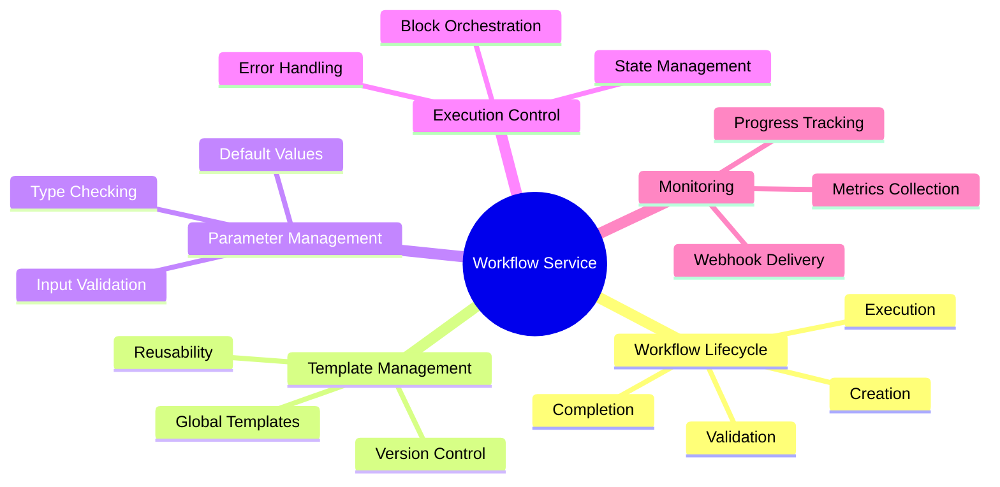
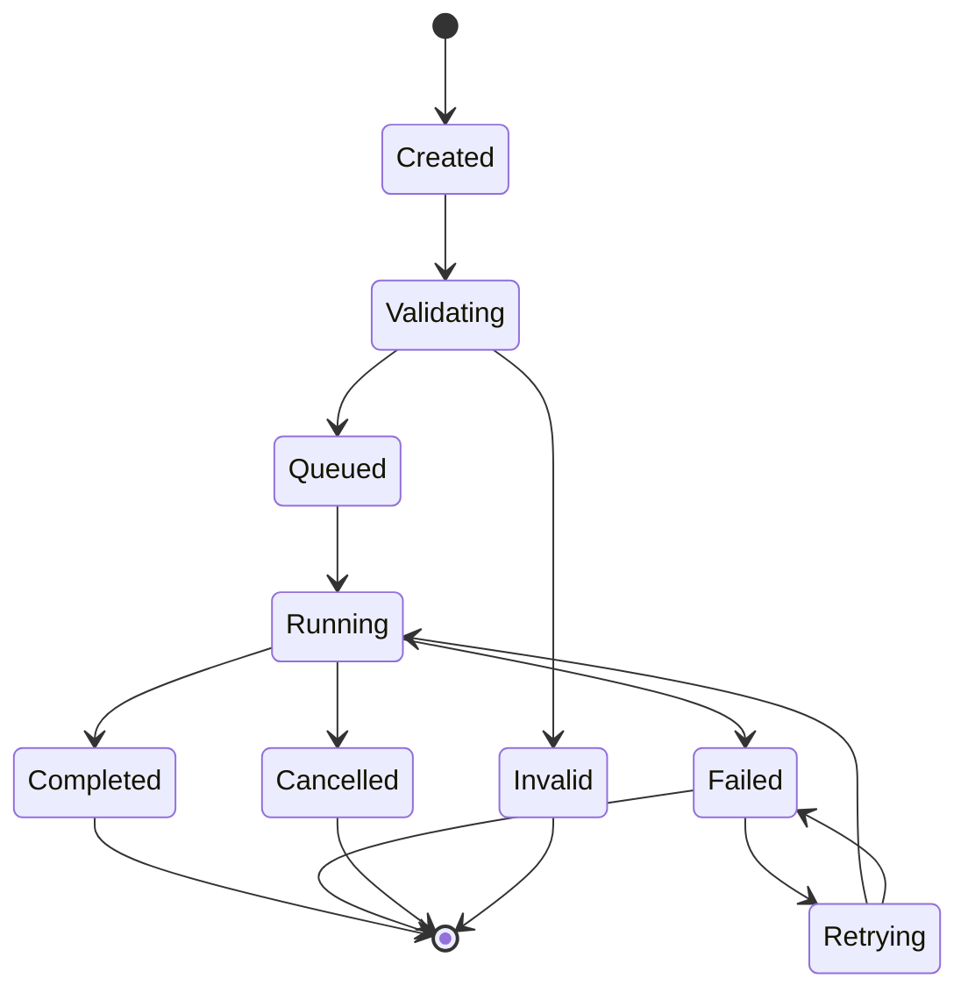
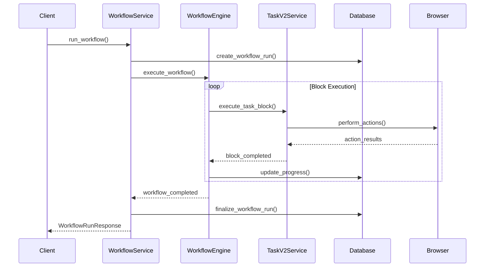
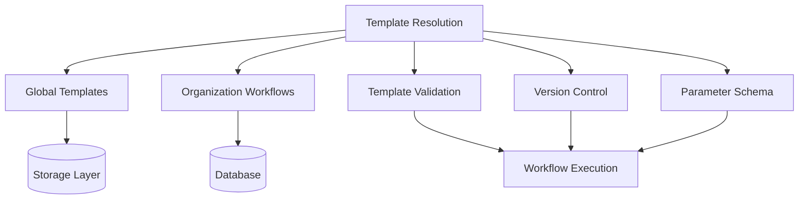
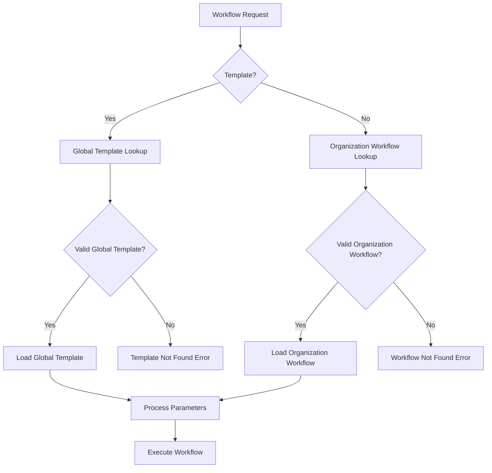
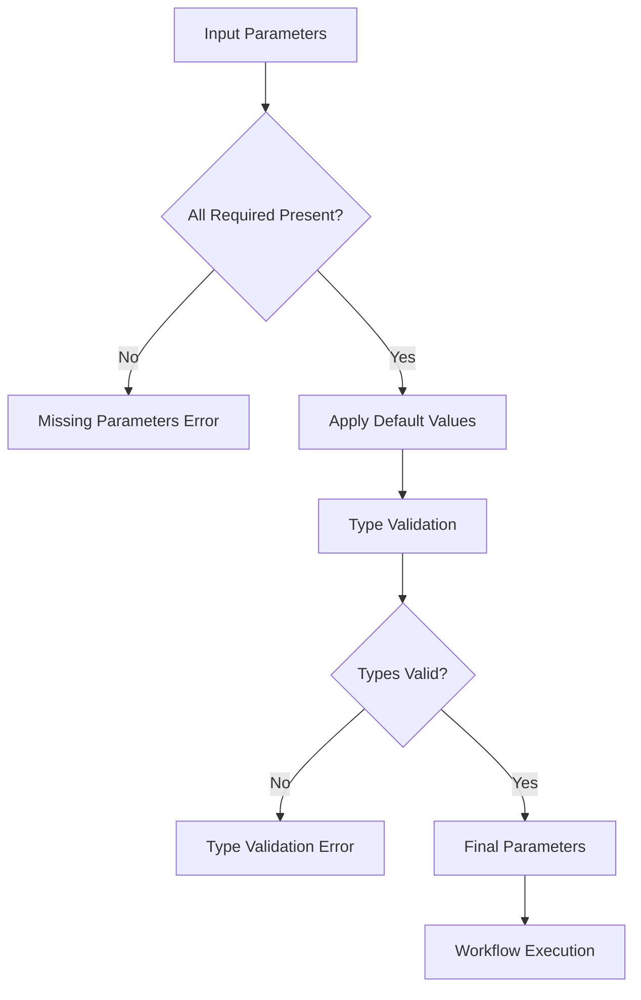
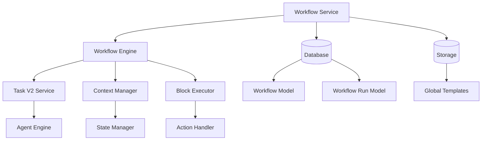
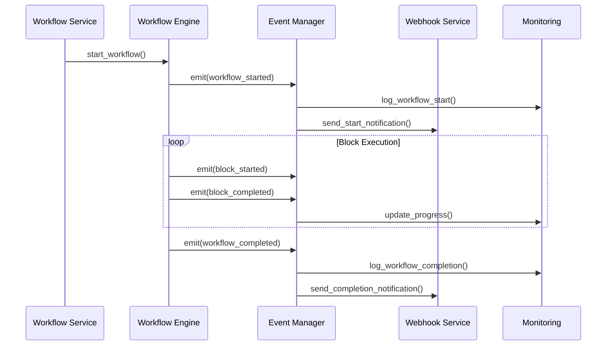
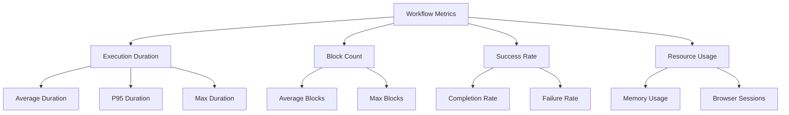
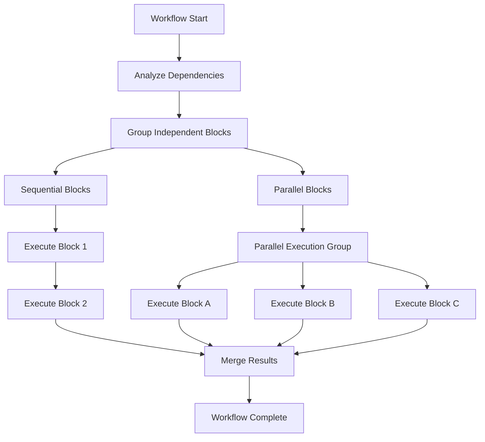

# 🔄 Workflow Service Business Logic
## Orchestration and Execution Management

---

## 📋 Presentation Agenda

1. **Workflow Service Architecture**
2. **Business Logic Components**
3. **Workflow Execution Flow**
4. **Template Management**
5. **Parameter Handling**
6. **Integration Patterns**
7. **Performance & Monitoring**

---

## 🏗️ Workflow Service Architecture

### **Core Service Structure**

```python
class WorkflowService:
    async def run_workflow(
        workflow_id: str,
        organization: Organization,
        workflow_request: WorkflowRequestBody,
        template: bool = False,
        version: int | None = None,
        max_steps: int | None = None,
        api_key: str | None = None,
        request_id: str | None = None
    ) -> WorkflowRun
    
    async def create_workflow(
        organization_id: str,
        title: str,
        workflow_definition: WorkflowDefinition,
        description: str | None = None
    ) -> Workflow
    
    async def execute_workflow(
        workflow_run_id: str,
        api_key: str | None,
        organization: Organization,
        browser_session_id: str | None
    ) -> WorkflowRun
```

### **Service Responsibilities**



---

## 🔧 Business Logic Components

### **1. Workflow Lifecycle Management**



### **2. Template Resolution Logic**

```python
async def resolve_workflow_template(
    workflow_id: str,
    template: bool,
    organization: Organization
) -> WorkflowDefinition:
    if template:
        # Global template workflow
        global_workflows = await app.STORAGE.retrieve_global_workflows()
        if workflow_id not in global_workflows:
            raise InvalidTemplateWorkflowPermanentId(workflow_id)
        return await load_global_template(workflow_id)
    else:
        # Organization-specific workflow
        workflow = await app.DATABASE.get_workflow(
            workflow_id=workflow_id,
            organization_id=organization.organization_id
        )
        if not workflow:
            raise WorkflowNotFound(workflow_id)
        return workflow.workflow_definition
```

### **3. Parameter Processing**

```python
async def process_workflow_parameters(
    workflow_definition: WorkflowDefinition,
    input_parameters: dict[str, Any]
) -> dict[str, Any]:
    # Validate required parameters
    required_params = extract_required_parameters(workflow_definition)
    validate_required_parameters(required_params, input_parameters)
    
    # Apply default values
    default_params = extract_default_parameters(workflow_definition)
    merged_params = merge_parameters(default_params, input_parameters)
    
    # Type validation
    validated_params = validate_parameter_types(
        workflow_definition.parameters,
        merged_params
    )
    
    return validated_params
```

---

## 🌊 Workflow Execution Flow

### **High-Level Execution Sequence**



### **Detailed Execution Logic**

```python
async def execute_workflow_logic(
    workflow_run_id: str,
    organization: Organization,
    browser_session_id: str | None
) -> WorkflowRun:
    # Initialize execution context
    workflow_run = await app.DATABASE.get_workflow_run(
        workflow_run_id=workflow_run_id,
        organization_id=organization.organization_id
    )
    
    # Start execution timer
    start_time = datetime.utcnow()
    
    try:
        # Execute via workflow engine
        result = await app.WORKFLOW_SERVICE.execute_workflow(
            workflow_run_id=workflow_run_id,
            api_key=api_key,
            organization=organization,
            browser_session_id=browser_session_id
        )
        
        # Calculate metrics
        duration = (datetime.utcnow() - start_time).total_seconds()
        
        # Log completion metrics
        LOG.info(
            "Workflow run duration metrics",
            workflow_run_id=workflow_run_id,
            duration_seconds=duration,
            workflow_run_status=WorkflowRunStatus.completed,
            organization_id=organization.organization_id
        )
        
        return result
        
    except Exception as e:
        # Handle execution failure
        await handle_workflow_failure(workflow_run_id, e)
        raise
```

---

## 📋 Template Management

### **Template Architecture**



### **Template Resolution Flow**



### **Version Management**

```python
async def handle_workflow_versioning(
    workflow_id: str,
    version: int | None,
    organization: Organization
) -> WorkflowDefinition:
    if version is not None:
        # Specific version requested
        workflow = await app.DATABASE.get_workflow_by_version(
            workflow_id=workflow_id,
            version=version,
            organization_id=organization.organization_id
        )
    else:
        # Latest version
        workflow = await app.DATABASE.get_latest_workflow(
            workflow_id=workflow_id,
            organization_id=organization.organization_id
        )
    
    if not workflow:
        raise WorkflowVersionNotFound(workflow_id, version)
    
    return workflow.workflow_definition
```

---

## 🎛️ Parameter Handling Deep Dive

### **Parameter Schema Validation**

```python
class WorkflowParameterSchema:
    def __init__(self, workflow_definition: WorkflowDefinition):
        self.parameter_schema = workflow_definition.parameters
        self.required_params = self.extract_required_parameters()
        self.default_values = self.extract_default_values()
    
    def validate_parameters(self, input_params: dict[str, Any]) -> dict[str, Any]:
        # Check required parameters
        missing_params = self.required_params - set(input_params.keys())
        if missing_params:
            raise MissingRequiredParameters(missing_params)
        
        # Apply defaults
        final_params = {**self.default_values, **input_params}
        
        # Type validation
        validated_params = self.validate_types(final_params)
        
        return validated_params
```

### **Parameter Flow Diagram**



### **Dynamic Parameter Injection**

```python
async def inject_runtime_parameters(
    workflow_definition: WorkflowDefinition,
    runtime_context: WorkflowContext
) -> dict[str, Any]:
    dynamic_params = {}
    
    # Inject system parameters
    dynamic_params.update({
        'workflow_run_id': runtime_context.workflow_run_id,
        'organization_id': runtime_context.organization_id,
        'timestamp': datetime.utcnow().isoformat(),
        'browser_session_id': runtime_context.browser_session_id
    })
    
    # Inject environment-specific parameters
    if runtime_context.proxy_location:
        dynamic_params['proxy_location'] = runtime_context.proxy_location
    
    # Inject authentication parameters
    if runtime_context.totp_url:
        dynamic_params['totp_url'] = runtime_context.totp_url
    
    return dynamic_params
```

---

## 🔗 Integration Patterns

### **Service Integration Architecture**



### **Event-Driven Integration**



### **Webhook Integration**

```python
async def handle_workflow_webhook(
    workflow_run: WorkflowRun,
    api_key: str | None
) -> None:
    if not workflow_run.webhook_callback_url:
        return
    
    # Prepare webhook payload
    webhook_payload = {
        'workflow_run_id': workflow_run.workflow_run_id,
        'workflow_id': workflow_run.workflow_id,
        'status': workflow_run.status,
        'created_at': workflow_run.created_at.isoformat(),
        'completed_at': workflow_run.completed_at.isoformat() if workflow_run.completed_at else None,
        'parameters': workflow_run.parameters,
        'outputs': workflow_run.outputs
    }
    
    # Send webhook with retry logic
    try:
        response = await send_webhook_with_retry(
            url=workflow_run.webhook_callback_url,
            payload=webhook_payload,
            headers={'Authorization': f'Bearer {api_key}' if api_key else None}
        )
        
        LOG.info(
            "Workflow webhook sent successfully",
            workflow_run_id=workflow_run.workflow_run_id,
            response_code=response.status_code
        )
    except Exception as e:
        LOG.error(
            "Failed to send workflow webhook",
            workflow_run_id=workflow_run.workflow_run_id,
            error=str(e)
        )
        raise FailedToSendWebhook(workflow_run.workflow_run_id) from e
```

---

## 📊 Performance & Monitoring

### **Performance Metrics**



### **Monitoring Implementation**

```python
class WorkflowMonitor:
    def __init__(self):
        self.metrics_collector = MetricsCollector()
        self.logger = structlog.get_logger(__name__)
    
    async def track_workflow_start(self, workflow_run: WorkflowRun):
        self.metrics_collector.increment('workflow.started')
        self.metrics_collector.histogram(
            'workflow.parameters.count',
            len(workflow_run.parameters or {})
        )
        
        self.logger.info(
            "Workflow execution started",
            workflow_run_id=workflow_run.workflow_run_id,
            workflow_id=workflow_run.workflow_id,
            organization_id=workflow_run.organization_id
        )
    
    async def track_workflow_completion(
        self,
        workflow_run: WorkflowRun,
        duration_seconds: float
    ):
        self.metrics_collector.increment(f'workflow.completed.{workflow_run.status}')
        self.metrics_collector.histogram('workflow.duration', duration_seconds)
        
        self.logger.info(
            "Workflow execution completed",
            workflow_run_id=workflow_run.workflow_run_id,
            status=workflow_run.status,
            duration_seconds=duration_seconds
        )
```

### **Resource Management**

```python
class WorkflowResourceManager:
    def __init__(self):
        self.active_workflows = {}
        self.resource_limits = {
            'max_concurrent_workflows': 100,
            'max_workflow_duration': 3600,  # 1 hour
            'max_blocks_per_workflow': 50
        }
    
    async def acquire_resources(self, workflow_run_id: str) -> bool:
        if len(self.active_workflows) >= self.resource_limits['max_concurrent_workflows']:
            raise ResourceLimitExceeded('max_concurrent_workflows')
        
        self.active_workflows[workflow_run_id] = {
            'start_time': datetime.utcnow(),
            'resource_usage': {}
        }
        
        return True
    
    async def release_resources(self, workflow_run_id: str):
        if workflow_run_id in self.active_workflows:
            workflow_info = self.active_workflows.pop(workflow_run_id)
            duration = (datetime.utcnow() - workflow_info['start_time']).total_seconds()
            
            LOG.info(
                "Workflow resources released",
                workflow_run_id=workflow_run_id,
                duration_seconds=duration
            )
```

---

## 🚀 Advanced Features

### **Conditional Execution**

```python
async def handle_conditional_blocks(
    workflow_definition: WorkflowDefinition,
    context: WorkflowContext
) -> List[WorkflowBlock]:
    executable_blocks = []
    
    for block in workflow_definition.blocks:
        if block.condition:
            # Evaluate condition
            condition_result = await evaluate_condition(
                block.condition,
                context.variables
            )
            if condition_result:
                executable_blocks.append(block)
        else:
            executable_blocks.append(block)
    
    return executable_blocks
```

### **Parallel Block Execution**



### **Error Recovery Strategies**

```python
async def handle_workflow_error(
    workflow_run_id: str,
    error: Exception,
    context: WorkflowContext
) -> WorkflowRecoveryAction:
    # Analyze error type
    if isinstance(error, TemporaryError):
        # Retry with backoff
        return WorkflowRecoveryAction.RETRY
    elif isinstance(error, BlockExecutionError):
        # Skip failed block if configured
        if context.skip_on_failure:
            return WorkflowRecoveryAction.SKIP_BLOCK
        else:
            return WorkflowRecoveryAction.FAIL_WORKFLOW
    elif isinstance(error, ResourceError):
        # Wait for resources
        return WorkflowRecoveryAction.WAIT_AND_RETRY
    else:
        # Unknown error - fail workflow
        return WorkflowRecoveryAction.FAIL_WORKFLOW
```

---

## 🎯 Learning Objectives Summary

### ✅ **Workflow Service Architecture**
- Service layer organization
- Component responsibilities
- Integration patterns

### ✅ **Business Logic Components**
- Lifecycle management
- Template resolution
- Parameter processing

### ✅ **Execution Flow**
- Orchestration patterns
- State management
- Error handling

### ✅ **Advanced Features**
- Conditional execution
- Parallel processing
- Resource management

---

## 📚 Best Practices

### **Service Design Principles**
1. **Single Responsibility** - Each method has one clear purpose
2. **Dependency Injection** - Services depend on abstractions
3. **Error Boundaries** - Clear error propagation
4. **Resource Management** - Proper cleanup and limits

### **Performance Optimization**
1. **Lazy Loading** - Load resources when needed
2. **Caching** - Cache frequently used templates
3. **Connection Pooling** - Reuse database connections
4. **Async Processing** - Non-blocking operations

### **Monitoring Strategy**
1. **Structured Logging** - Consistent log format
2. **Metrics Collection** - Key performance indicators
3. **Health Checks** - Service availability monitoring
4. **Alerting** - Proactive error detection

---

## 🔄 Next Integration Points

### **Workflow Engine Deep Dive**
- Block execution mechanics
- Context management
- State persistence

### **Task V2 Integration**
- How workflows create tasks
- Task lifecycle within workflows
- Result aggregation patterns